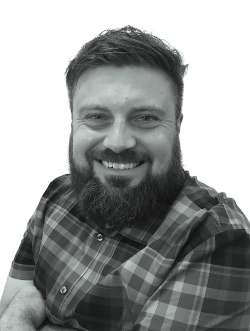

I am an *Associate Professor* at the **Department of Mathematics** at the **University of Houston**. On this page you can find information about my [research](research/) and the [classes I teach](teaching/).

{: .profile-img }

### Contact

| | |
|---|---|
| **Name** | Andreas Mang &ensp; [/an'dre:as mang/] |
| **Group** | Numerical Analysis and Scientific Computing |
| **Department** | Department of Mathematics |
| **University** | University of Houston |
| **Email** | andreas@math.uh.edu |
| **Office** | TBD |

### Research Interests

The goal of my research is the development, analysis, and deployment of computational and mathematical methods that integrate *data* with *simulation* and *optimization* with the aspiration to support *decision making* in challenging problems in the applied sciences.

## News

- **02/2026** -- Serving as SIAM Coordinating Committee member for JMM2027 in Chicago, IL
- **01/2026** -- Talk in CMOR Colloquium Series at Rice University, March 30, 2026
- **01/2026** -- Virtual talk at HPE Data Science Institute, UH, February 26, 2026
- **11/2025** -- Co-organizing mini-symposium at SIAM UQ26, Minneapolis, March 22-25, 2026
- **10/2025** -- Co-chair for SIAM Conference on Mathematics of Data Science (MDS26), Salt Lake City, November 16-20, 2026
- **10/2025** -- Long Term Visitor at ICERM Special Semester, Providence, RI, January 20 - April 24, 2026
- **10/2025** -- Co-organizing workshop at Casa Matematica Oaxaca, May 31 - June 5, 2026

## Older News

<strong>2025</strong>

Talks at SIAM CSE25, SIAM UQ26 mini-symposium organization, CBMS AMML Conference at UH, ChAMELEON Summer School, ICERM Special Semester visit.

<strong>2024</strong>

Talks at SIAM conferences, workshop organization, invited lectures, continued work on NSF CAREER Award projects.

<strong>2023</strong>

Dagstuhl Seminar on Inverse Biophysical Modeling and Machine Learning in Personalized Oncology, talks at SIAM CSE23 and other venues, new PhD students joined the group.

<strong>2022</strong>

NSF CAREER Award (DMS-2145845), talks at SIAM conferences, workshops organized, new collaborations established.

## Open Positions

I have research projects for graduate and undergraduate students. If you are interested in working with me, please reach out.
